基于SpringBoot的社区医院管理系统（程序+论文）
=
- 完整代码获取地址：从戎源码网 ([https://armycodes.com/](https://armycodes.com/))
- 作者微信：19941326836  QQ：952045282 
- 承接计算机毕业设计、Java毕业设计、Python毕业设计、深度学习、机器学习
- 选题+开题报告+任务书+程序定制+安装调试+论文+答辩ppt 一条龙服务
- 所有选题地址https://github.com/nature924/allProject

一、项目介绍
---
基于Spring Boot框架实现的社区医院管理系统，系统包含四种角色：管理员、前台、医生、用户,系统分为前台和后台两大模块，主要功能如下。
### 管理员：
- 个人中心：管理个人信息。
- 管理员管理：管理系统管理员的基本信息。
- 病例信息管理：管理患者的病例信息。
- 基础数据管理：管理系统的基础数据信息。
- 家庭医生管理：管理家庭医生的基本信息。
- 健康档案管理：管理患者的健康档案信息。
- 就诊信息管理：管理就诊信息和患者的病历等相关信息。
- 前台管理：管理前台工作人员的基本信息。
- 药品管理：管理医院药品库存信息。
 
### 前台：
- 个人中心：管理个人信息。
- 病例信息管理：管理患者的病例信息。
- 健康档案管理：管理患者的健康档案信息。
- 就诊信息管理：管理就诊信息和患者的病历等相关信息。
- 药品管理：管理药品的基本信息。

### 医生：
- 个人中心：管理个人信息。
- 病例信息管理：管理患者的病例信息。
- 健康档案管理：管理患者的健康档案信息。
- 就诊信息管理：管理就诊信息和患者的病历等相关信息。
- 药品管理：管理药品的基本信息。

### 用户：
- 个人中心：管理个人信息。
- 病例信息管理：管理个人的病例信息。
- 家庭医生管理：管理家庭医生的基本信息。
- 健康档案管理：管理个人的健康档案信息。
- 就诊信息管理：管理就诊信息和个人的病历等相关信息。
- 药品管理：管理个人用药信息。

二、项目技术
---
- 编程语言：Java
- 数据库：MySQL
- 项目管理工具：Maven
- 前端技术：VUE、HTML、Jquery、Bootstrap
- 后端技术：Spring、SpringMVC、MyBatis

三、运行环境
---
- 操作系统：Windows、macOS都可以
- JDK版本：JDK1.8以上都可以
- 开发工具：IDEA、Ecplise、Myecplise都可以
- 数据库: MySQL5.7以上都可以
- Tomcat：任意版本都可以
- Maven：任意版本都可以

四、运行截图
---
### 论文截图：
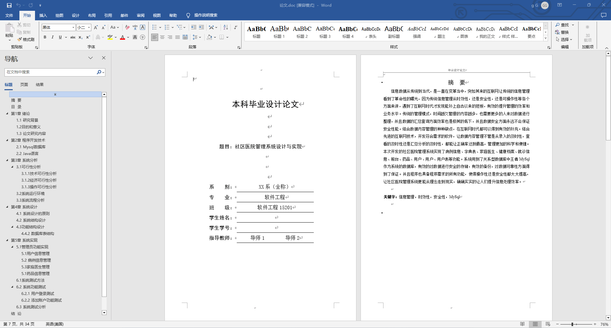
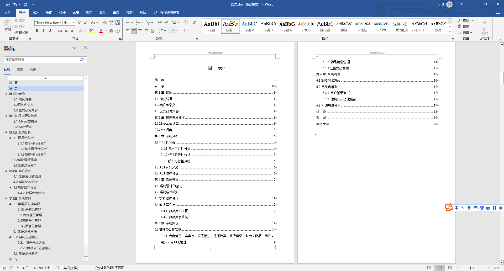

### 程序截图：
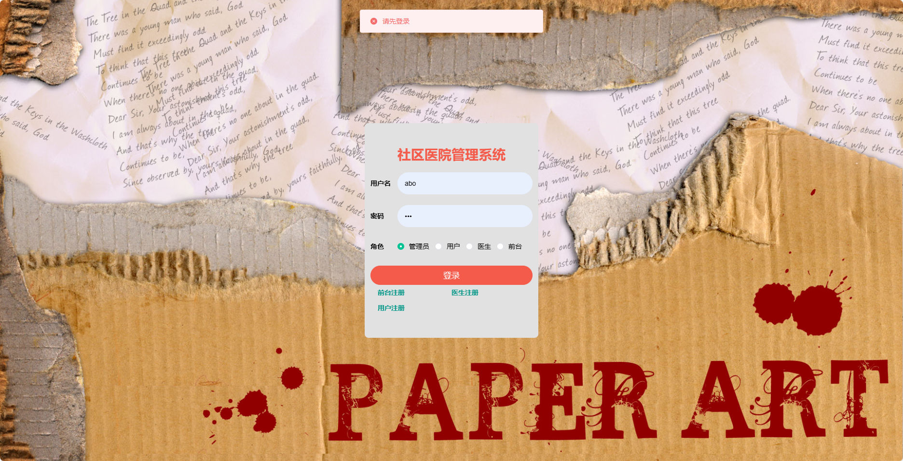
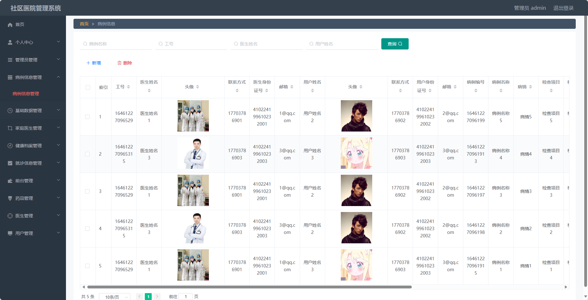
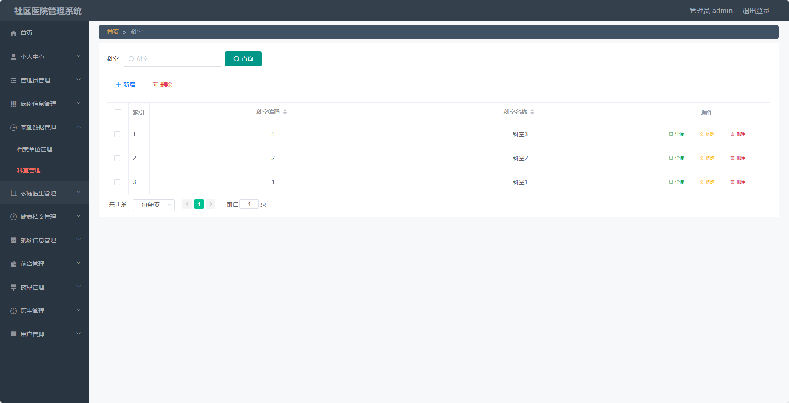
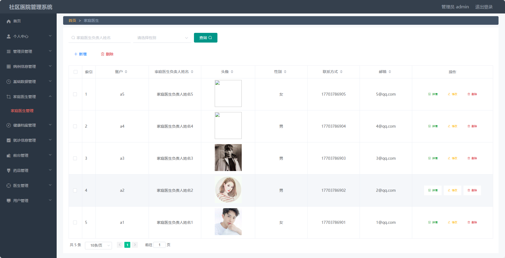
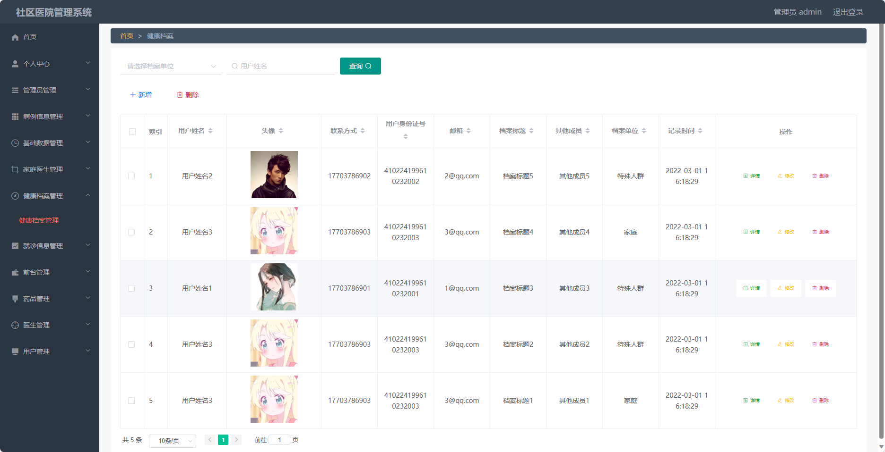
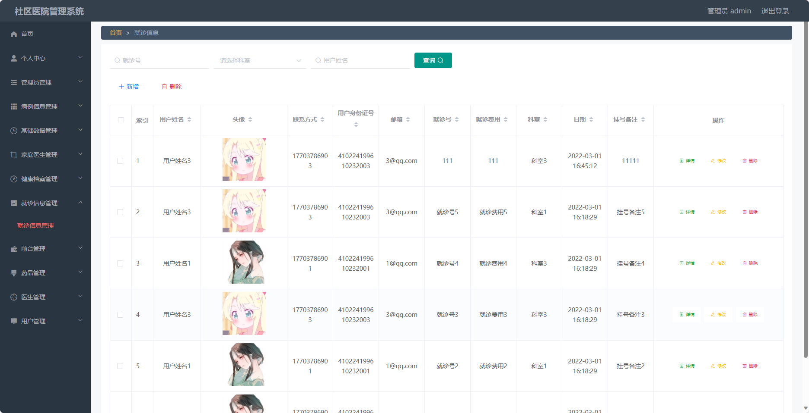
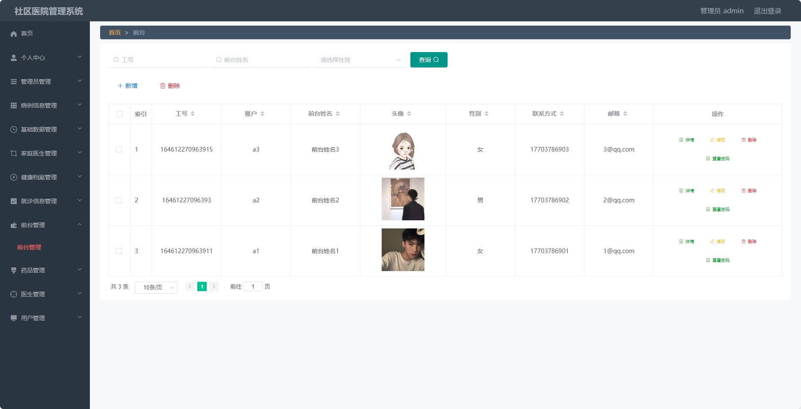
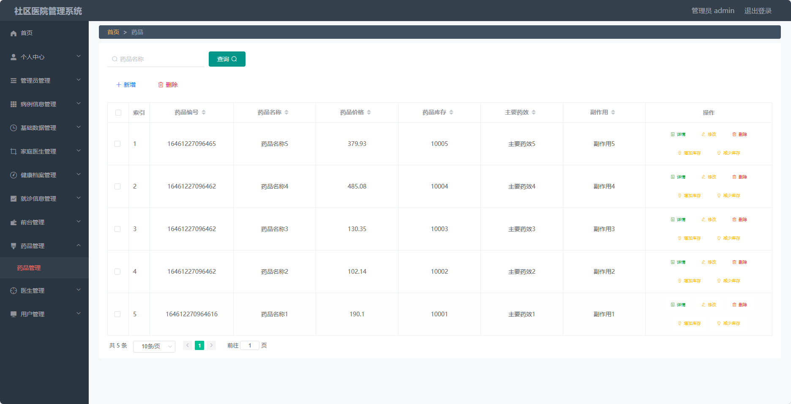
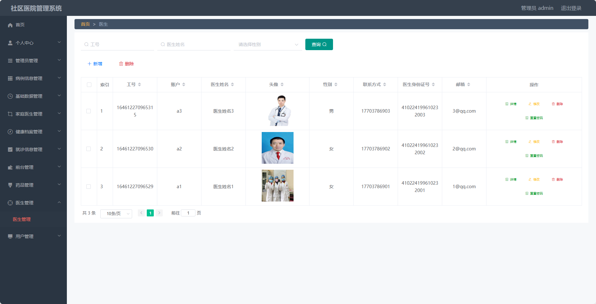
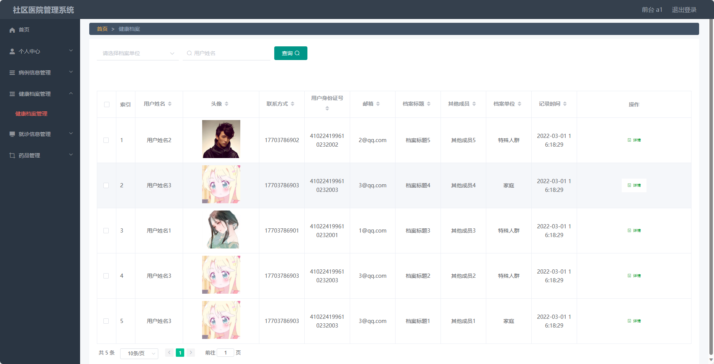

